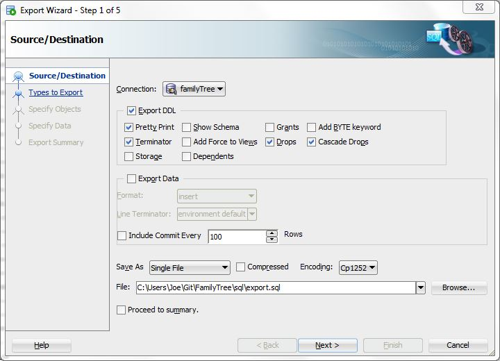

# Exporting

## For [master.sql](master.sql)

### Step 1

### Step 2 and 3

Just click "Next &gt;"

### Step 4

### Step 5

Click "Finish"

## For subdirectories

### Step 1

### Step 2 and 3

Just click "Next &gt;"

### Step 4

### Step 5

Click "Finish"